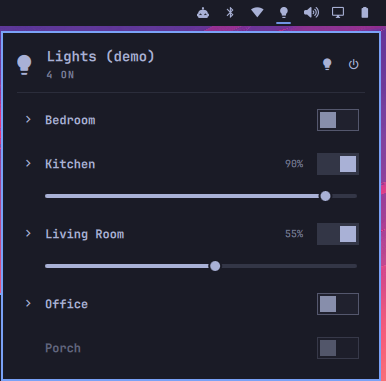

# Home Assistant Lights for Omarchy

A bar widget for [Omarchy](https://omarchy.org/) that controls your
[Home Assistant](https://www.home-assistant.io/) lights by room: switch rooms
or single bulbs on and off, set brightness, or turn the whole house on or off.



## Features

- **Rooms from Home Assistant areas.** Each area with lights gets a row with an
  on/off switch and a brightness slider. Expand a room to control its bulbs.
- **All on / all off** from the panel header. Right-click the bar icon to turn
  everything off.
- **Feels instant.** Clicks show right away and are held until Home Assistant
  confirms, so switches don't flicker back while Hue and other hubs catch up.
- **Follows your theme** using Omarchy's own panel, switch, and slider
  components.
- **Keeps your token out of the shell.** Only the bundled `ha-lights` script
  reads it (see [Security](#security)).

## Requirements

- Omarchy 4.x (uses the Quickshell-based bar)
- Home Assistant reachable from your machine
- A Home Assistant long-lived access token

`curl` and `jq` are also needed; both ship with Omarchy.

## Install

```bash
omarchy plugin add https://github.com/vscarpenter/omarchy-ha-lights.git
```

Review the code when prompted, then enable it and place it in the bar:

```bash
omarchy plugin enable vscarpenter.ha-lights
omarchy bar move vscarpenter.ha-lights --section right --before omarchy.audio
```

Want to try it before connecting anything? Turn on demo mode (made-up rooms,
nothing leaves your machine):

```bash
omarchy bar set vscarpenter.ha-lights demo On
```

## Connect to Home Assistant

1. **Create a token.** In Home Assistant, open your profile, go to the
   **Security** tab, and under **Long-lived access tokens** choose
   **Create token**. Copy it.

2. **Save the token to a file** only you can read. This prompts for the token
   without echoing it or saving it to shell history:

   ```bash
   mkdir -p ~/.config/homeassistant
   read -rs HA_TOKEN && printf '%s' "$HA_TOKEN" > ~/.config/homeassistant/token \
     && chmod 600 ~/.config/homeassistant/token && unset HA_TOKEN
   ```

3. **Set your Home Assistant URL** if it isn't `http://homeassistant.local:8123`:

   ```bash
   omarchy bar set vscarpenter.ha-lights url http://192.168.1.50:8123
   ```

4. **Assign lights to areas** in Home Assistant (Settings → Areas, labels &
   zones) if you haven't. Lights without an area don't appear in the widget.

If demo mode was on, turn it off with
`omarchy bar set vscarpenter.ha-lights demo Off`.

## Settings

Change these in Omarchy's bar settings or with `omarchy bar set`.

| Key | Default | What it does |
|---|---|---|
| `url` | `http://homeassistant.local:8123` | Home Assistant base URL, including the port |
| `tokenFile` | `~/.config/homeassistant/token` | File holding the long-lived access token |
| `refreshIntervalSec` | `45` | How often to check light state while the panel is closed (every 5s while open) |
| `demo` | `Off` | `On` shows made-up rooms without connecting to Home Assistant |

## Usage

| Action | What happens |
|---|---|
| Left-click the bulb icon | Open or close the panel |
| Right-click the bulb icon | Turn **every** light off |
| Middle-click the bulb icon | Refresh now |
| Room switch or slider | Controls every light in that area |
| Arrow next to a room | Show that room's bulbs |
| `r` / `Esc` in the panel | Refresh / close |

The bulb icon is filled when any light is on, and its tooltip shows how many.

### How rooms are built

Rooms are Home Assistant areas that contain lights. If an area has a light
group, such as a Hue room, the group is used for the room's switch and
brightness, and the other lights are listed as bulbs. Turning a room on or off,
or setting its brightness, targets the whole area.

## Command line

The plugin's `ha-lights` script works on its own, which is handy for
keybindings or troubleshooting:

```bash
cd ~/.config/omarchy/plugins/vscarpenter.ha-lights
./ha-lights --url http://192.168.1.50:8123 status | jq
./ha-lights toggle area:kitchen
./ha-lights brightness light.desk_lamp 40
./ha-lights all-off
```

Targets are `area:<area_id>` or a light entity id. Run `./ha-lights` with no
arguments for the full usage.

## Security

- The token is read from `tokenFile` by the `ha-lights` script on each request
  and passed to `curl` through a file descriptor. It never appears in process
  arguments, environment variables, the widget's QML state, or command output.
- Keep the token file private (`chmod 600`). Anyone who can read it can control
  your Home Assistant.
- Like every Omarchy plugin, this runs as unsandboxed code inside
  `omarchy-shell`. Read the code before enabling it.
- Home Assistant URLs are often plain `http://` on a home network. If you point
  this at a remote instance, use `https://`.

To revoke access, delete the token in your Home Assistant profile.

## Troubleshooting

- **"Not connected" in the panel.** The message under the header says why.
  Test the connection from a terminal with the command-line example above.
- **`homeassistant.local` doesn't resolve.** Use the IP address instead, or
  check that Avahi/mDNS is working.
- **A room or light is missing.** Assign it to an area in Home Assistant.
- **Connection works but status fails.** The token's user may lack permission
  for the Home Assistant template API. Try a token from an administrator
  account.
- **Editing the plugin.** Changes to `BarWidget.qml` reload on save, but
  `Panel.qml` changes need `omarchy restart shell`.

## Update and uninstall

```bash
omarchy plugin update vscarpenter.ha-lights
omarchy plugin remove vscarpenter.ha-lights
```

## License

[MIT](LICENSE)
